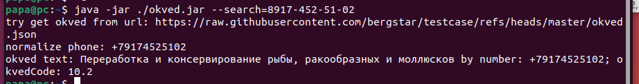

# Запуск приложения
Приложение оквед, для поиска окведа по окончанию номер телеофна. Используется java 17 
Для конфигурации приложения используется application.yml файл, где указывается ссылка, где можно взять оквед.
./src/application.yml. <br>
Приложение запускается с атрибутом --search, номер должен быть в формате
+79, 79 или 89 ниже рабочий пример:
```aidl
java.exe -jar ./okved.jar --search=89174501251

--Также можно передать путь до yml конфига через --config=
java.exe -jar ./okved.jar --search=89174501251 --config=./application.yml
```

Пример


